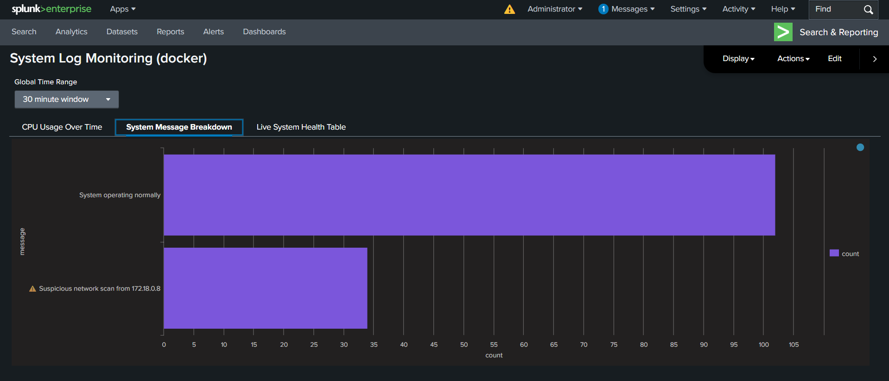
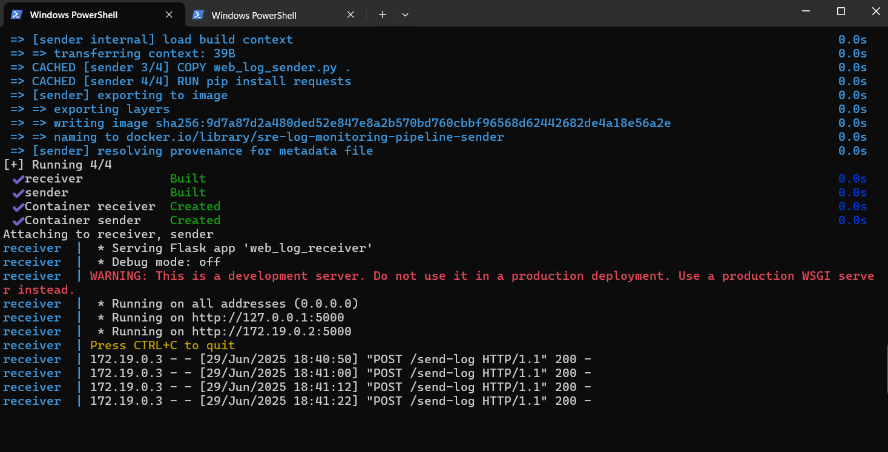
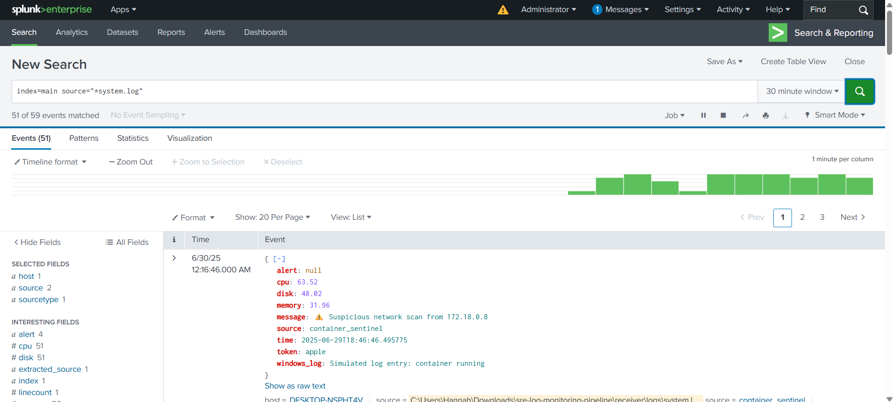

# System Log Monitoring Pipeline

A containerized log monitoring system using Python, Flask, Docker, and Splunk. Designed to simulate real-time telemetry, forward structured logs, and visualize system health in dashboards. Built to demonstrate practical observability, alerting, and infrastructure automation for Site Reliability Engineering workflows.

## Stack Used

- Python 3.10
- Docker + Docker Compose
- Flask (log receiver)
- psutil + requests (sender)
- Splunk (log visualization and alerting)
- Terraform (in progress) for EC2 deployment

## Features

- Real-time system telemetry generation (CPU, memory, disk)
- Token-based authentication
- Dockerized sender and receiver containers
- Structured JSON logs written to file and Splunk
- Dashboards showing system metrics and alerts
- Optional cloud deployment using Terraform
  
## 🧪 Screenshots

### 🎯 System Dashboard (Splunk)




### 🐳 Docker Containers Running



### 📥 Search and Reporting (Splunk)


Got it. Here's a **clean Markdown version of only the section you sent**, properly formatted so you can **copy-paste** it into your `README.md`:

---

````markdown
## Getting Started

### 1. Clone the repository

```bash
git clone https://github.com/hnaah20/sre-log-monitoring-pipeline
cd sre-log-monitoring-pipeline
````

### 2. Start with Docker Compose

```bash
docker-compose up --build
```

### 3. Access services

* **Flask Log Receiver**: [http://localhost:5000](http://localhost:5000)
* **Splunk**: [http://localhost:8000](http://localhost:8000) *(if configured locally)*
* **Logs are saved to**: `receiver/logs/system.log`

---

## 👩‍💻 Author

**Hannah Susan Cherian**
Final-year B.Tech CSE (Cybersecurity) | VIT-AP University
📧 [x.hannah999@gmail.com](mailto:x.hannah999@gmail.com)
🔗 [LinkedIn](https://linkedin.com/in/hannah-susan-cherian694317275)

```

---
